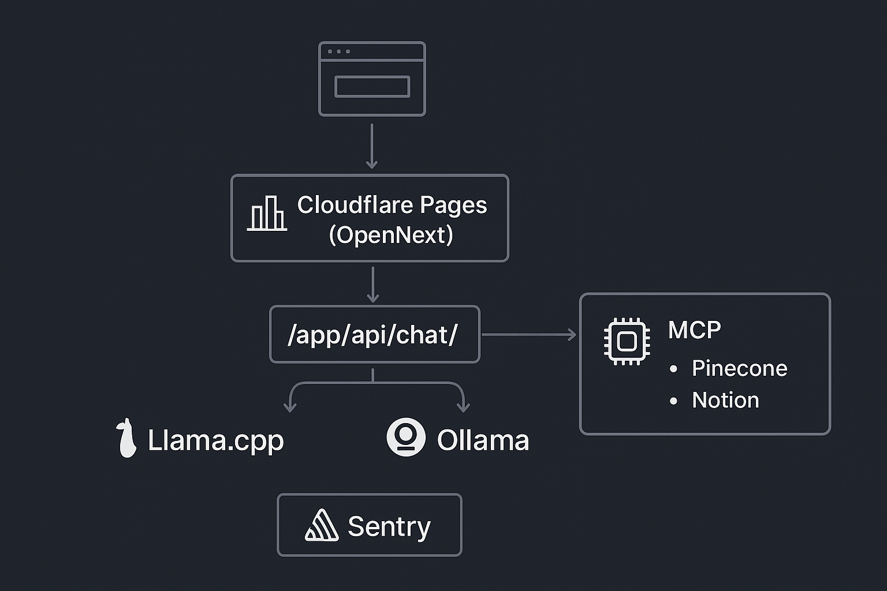

# Project Architecture

This document outlines the high-level architecture of the AI-Powered Portfolio project.

## System Overview

The AI-Powered Portfolio is built on a modern, cloud-native architecture designed for scalability, resilience, and intelligent interactions. It leverages a Next.js frontend deployed on Cloudflare Pages, with AI services orchestrated through a combination of local and cloud-based models.

## Architecture Flowchart

Here's a visual representation of the system's architecture:

```mermaid
flowchart TD
  Browser --> Cloudflare[Cloudflare Pages (OpenNext)]
  Cloudflare --> EdgeAPI[/app/api/chat/]
  EdgeAPI -->|proxy| Llama[llama.cpp (container/VM)]
  EdgeAPI -->|fallback| Ollama[Ollama runtime]
  EdgeAPI -->|fallback| OpenAI[OpenAI]
  EdgeAPI --> MCP[MCP tools (Pinecone, Notion)]
  MCP --> Pinecone[Pinecone Vector DB]
  MCP --> Notion[Notion API]
  Observability[Sentry] -. logs .-> EdgeAPI
  Observability -. logs .-> Llama
```

## Visual Architecture Diagram

For a more detailed visual representation, refer to the architecture flowchart:



## Key Components and Technologies

*   **Frontend:** Next.js (App Router, TypeScript) with ShadCN UI for a responsive and modern user interface.
*   **Edge Layer:** Cloudflare Pages and Workers (via OpenNext adapter) for fast, global content delivery and API routing.
*   **AI Services:**
    *   **OpenAI:** Primary cloud-based LLM for chat completions and embeddings.
    *   **Ollama:** Local/edge LLM for fallback and offline capabilities.
    *   **llama.cpp:** Local inference engine for running smaller, optimized models (e.g., Gemma).
*   **Vector Database:** Pinecone for efficient storage and retrieval of contextual information and project data.
*   **CMS:** Notion API for managing and serving project content.
*   **Agent Orchestration:** LangChain/LangGraph for building intelligent agents and automating multi-step tasks.
*   **Observability:** Sentry for error tracking and performance monitoring.
*   **CI/CD:** GitHub Actions for automated build, test, and deployment workflows.

## Data Flow

1.  User interacts with the Next.js UI in the browser.
2.  Requests for AI interactions are routed through Cloudflare Pages to edge API routes (`/api/chat`).
3.  The edge API acts as a proxy, attempting to use local LLMs (llama.cpp, Ollama) first, with OpenAI as a cloud fallback.
4.  AI agents leverage MCP tools to interact with Pinecone (for knowledge retrieval) and Notion (for project data).
5.  Observability tools (Sentry) log events and metrics from the edge API and local LLMs.

This architecture ensures a resilient, scalable, and intelligent portfolio experience.
