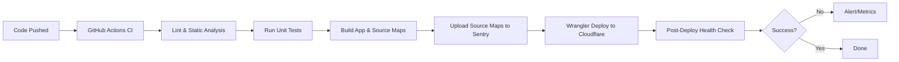

# CI/CD Pipeline

This document describes the automated Continuous Integration and Continuous Deployment (CI/CD) pipeline for the AI-Powered Portfolio application, leveraging GitHub Actions and Cloudflare Pages/Workers. Our pipeline is designed for efficiency, reliability, and adherence to modern deployment best practices.

## Pipeline Overview

The CI/CD pipeline is triggered automatically on every commit to the `main` branch. It orchestrates a series of steps including linting, unit testing, building the application, uploading assets, and deploying to Cloudflare Workers/Pages.

While Cloudflare's own Workers Builds could be used, we opt for GitHub Actions to provide greater flexibility and control over the build and deployment process.

## Jobs and Steps

A typical workflow within our CI/CD pipeline includes the following jobs and steps:

1.  **Checkout & Setup:**
    *   Pulls the latest code from the repository.
    *   Sets up the Node.js environment and any necessary LangChain dependencies.

2.  **Lint & Static Analysis:**
    *   Runs ESLint and TypeScript checks to enforce code quality standards and identify potential issues early.

3.  **Unit Tests:**
    *   Executes all unit tests to verify the correctness of individual components and functions.
    *   Generates and reports code coverage metrics.

4.  **Build App & Source Maps:**
    *   Compiles the Next.js application for production.
    *   Generates source maps. For Cloudflare Workers, `upload_source_maps = true` is set in `wrangler.toml` to enable source map uploading for better debugging.

5.  **Upload Source Maps to Sentry:**
    *   Utilizes the Sentry CLI or a dedicated GitHub Action to upload the generated source maps to Sentry, ensuring readable stack traces for error monitoring.

6.  **Wrangler Deploy to Cloudflare:**
    *   Uses the official Cloudflare Wrangler Action to deploy the application to Cloudflare Pages/Workers.
    *   API tokens and account IDs (e.g., `CLOUDFLARE_API_TOKEN`, `CLOUDFLARE_ACCOUNT_ID`) are securely configured as GitHub Secrets and are never exposed in code.

7.  **Post-Deploy Health Check:**
    *   After deployment, a step pings a health-check endpoint (e.g., `/api/health`) to verify that the application is responding correctly.
    *   Failures at this stage will abort the pipeline and trigger alerts.

## CI/CD Flowchart



## CI/CD Best Practices

Our CI/CD flow adheres to industry best practices and Cloudflare guidelines:

*   **Consistency and Security:** Automating deploys ensures consistency and security. Sensitive tokens are stored as secrets.
*   **Lock-step Deployments:** We utilize lock-step deployments for controlled releases.
*   **Branching Strategy:** Deploys primarily happen from the `main` branch. Feature branches can be built to preview environments using Cloudflare Preview.
*   **Monitoring:** The pipeline reports status to team chat and dashboards. Failed steps (lint, tests, health checks) block merging to prevent regressions.
*   **Documentation:** The CI workflow file (`.github/workflows/deploy.yml`) includes comments and references for clarity. We also version the Terraform/Wrangler configuration for Infrastructure-as-Code (IaC).

## Key Rotation (Maintenance)

We implement scheduled jobs or scripts that can rotate API keys/tokens (e.g., daily or weekly). This process leverages GitHub Actions and Cloudflare APIs to refresh credentials automatically, enhancing security posture.

## Deployment Configuration Example

Below is an example of the GitHub Actions workflow (`.github/workflows/deploy.yml`) for deploying to Cloudflare Pages:

```yaml
name: Deploy to Cloudflare Pages

on:
  push:
    branches: [main]
  pull_request:
    branches: [main]

jobs:
  deploy:
    runs-on: ubuntu-latest
    permissions:
      contents: read
      deployments: write
    steps:
      - name: Checkout
        uses: actions/checkout@v4

      - name: Setup Node
        uses: actions/setup-node@v4
        with:
          node-version: 20
          cache: 'npm'

      - name: Install dependencies
        run: npm ci

      - name: Build
        run: npm run build
        env:
          OPENAI_API_KEY: ${{ secrets.OPENAI_API_KEY }}
          NOTION_API_KEY: ${{ secrets.NOTION_API_KEY }}
          NOTION_DATABASE_ID: ${{ secrets.NOTION_DATABASE_ID }}
          PINECONE_API_KEY: ${{ secrets.PINECONE_API_KEY }}
          PINECONE_ENVIRONMENT: ${{ secrets.PINECONE_ENVIRONMENT }}
          PINECONE_INDEX: ${{ secrets.PINECONE_INDEX }}

      - name: Publish to Cloudflare Pages
        uses: cloudflare/pages-action@1
        with:
          apiToken: ${{ secrets.CLOUDFLARE_API_TOKEN }}
          accountId: ${{ secrets.CLOUDFLARE_ACCOUNT_ID }}
          projectName: 'ai-portfolio'
          directory: '.next'
          gitHubToken: ${{ secrets.GITHUB_TOKEN }}
```

## Sentry Integration Example

Here's how Sentry is initialized for server and client, and how sourcemaps are uploaded during CI build:

```typescript
// sentry.server.config.ts
import * as Sentry from "@sentry/nextjs";
Sentry.init({
  dsn: process.env.SENTRY_DSN,
  tracesSampleRate: 0.1,
  environment: process.env.NODE_ENV,
});
```

And the CI step for uploading sourcemaps:

```yaml
      - name: Upload sourcemaps to Sentry
        run: |
          npx @sentry/cli releases new ${{ github.sha }}
          npx @sentry/cli releases files ${{ github.sha }} upload-sourcemaps .next --rewrite
        env:
          SENTRY_AUTH_TOKEN: ${{ secrets.SENTRY_AUTH_TOKEN }}
```